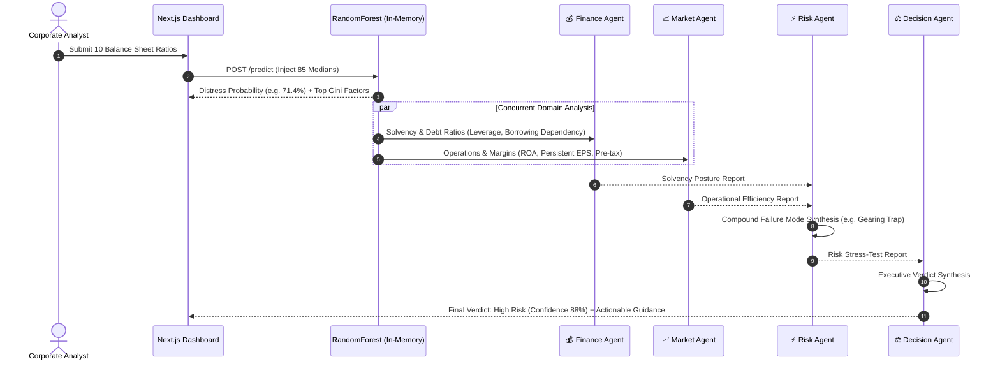

# Verdyx — Enterprise Decision Intelligence Platform

**An ML-Powered Multi-Agent System for Predictive Enterprise Solvency & Strategic Risk Intelligence**

[](https://nextjs.org/)
[](https://fastapi.tiangolo.com/)
[](https://langchain-ai.github.io/langgraph/)
[](https://scikit-learn.org/)
[]()
[](https://creativecommons.org/licenses/by/4.0/)

---

## 🏛️ System Overview

**Verdyx** is an enterprise decision intelligence platform that solves a core vulnerability in traditional Generative AI systems: **hallucinated, non-deterministic financial risk estimations**.

### The Core Architectural Invariant
> **Prediction is architecturally prior to interpretation.**  
> The empirical Machine Learning model executes *first*, computing a distress probability and Gini feature attributions directly from corporate balance sheet ratios. The LangGraph Multi-Agent network acts strictly as an interpretation and stress-testing layer — agents **never** guess or alter the prediction.



---

## 🚀 Key Features

- **Empirical ML Core:** In-memory `RandomForestClassifier` trained on 6,819 verified corporate financial profiles from the Taiwan Economic Journal (UCI Machine Learning Repository).
- **Specialized Multi-Agent Squad (LangGraph + Groq):**
  - **Finance Agent:** Evaluates solvency, liquidity cushions, borrowing dependency, and debt-to-equity leverage.
  - **Market Agent:** Interprets operational efficiency, return on assets (ROA), pricing power, and multi-period EPS consistency.
  - **Risk Agent:** Uncovers cross-domain compound vulnerabilities (e.g., high leverage combined with thin operating margins).
  - **Decision Agent:** Synthesizes domain reports into an authoritative executive verdict (`High Risk`, `Medium Risk`, `Low Risk`) with confidence scoring.
- **Interactive Executive Dashboard:**
  - **1-Click Scenario Presets:** Instantly load *Acute Distress*, *Marginal Solvency*, or *Resilient Corporate* financial profiles.
  - **Radial Risk Gauge:** Color-coded probability arc with real-time confidence metrics.
  - **Gini Feature Attribution:** Recharts horizontal bar chart visualizing the top mathematical drivers behind the prediction.
  - **What-If Sensitivity Sandbox:** Dynamic lever sliders allowing executives to simulate the impact of debt restructuring or revenue improvements in real time.
  - **LocalStorage History:** Past evaluations persist in browser storage for instant reload without external database dependencies.
- **Unified Full-Stack Monorepo:** Next.js App Router frontend and FastAPI serverless gateway deployed under a unified domain with zero CORS friction.

---

## 📊 Machine Learning Model Performance

Trained using `class_weight='balanced'` to explicitly overcome the severe 3.23% corporate insolvency class imbalance:

| Metric | Score | Industry Interpretation |
|---|---|---|
| **ROC-AUC** | **`0.9506`** | Exceptional discriminative power across all decision thresholds |
| **Precision (Distressed Class)** | **`0.5263`** | Low false positive rate on solvent enterprises |
| **Recall (Distressed Class)** | **`0.4545`** | Strong sensitivity to early pre-distress signals |
| **F1 Score** | **`0.4878`** | Balanced harmonic mean on minority distressed records |

### Top 10 Form Input Features & Dataset Medians

| # | Ratio Name | Domain | Dataset Median | Healthy Direction |
|---|---|---|:---:|:---:|
| 1 | **Borrowing Dependency** | Solvency | `0.37` (37%) | Lower |
| 2 | **Total Debt / Net Worth** | Solvency | `0.02` (0.02x) | Lower |
| 3 | **Persistent EPS (Last 4 Seasons)** | Operations | `0.22` | Higher |
| 4 | **Net Income to Total Assets (ROA)** | Operations | `0.80` (80%) | Higher |
| 5 | **Retained Earnings to Total Assets** | Solvency | `0.93` (93%) | Higher |
| 6 | **Continuous Interest Rate (After Tax)** | Operations | `0.78` (78%) | Higher |
| 7 | **Debt Ratio %** | Solvency | `0.11` (11%) | Lower |
| 8 | **Net Worth / Assets** | Solvency | `0.88` (88%) | Higher |
| 9 | **Pre-Tax Profit / Paid-in Capital** | Operations | `0.17` (17%) | Higher |
| 10 | **After-Tax Net Interest Rate** | Operations | `0.80` (80%) | Higher |

---

## 🛠️ Monorepo Architecture & Directory Layout

```
verdyx/
├── api/
│   ├── index.py                    # Vercel Serverless Function entrypoint (@vercel/python)
│   └── requirements.txt            # Serverless runtime dependencies
├── backend/                        # FastAPI Core & LangGraph Multi-Agent Pipeline
│   ├── main.py                     # App factory, CORS, dynamic model loader
│   ├── requirements.txt            # Python dependencies (scikit-learn 1.9.0, langgraph)
│   ├── agents/                     # Finance, Market, Risk, Decision agent nodes
│   ├── orchestrator/               # LangGraph 5-node StateGraph & LLM config
│   ├── prediction/                 # ML Predictor service & 10-ratio feature config
│   └── routers/                    # POST /predict and GET /predict endpoints
├── frontend/                       # Next.js 16 App Router (TypeScript + Tailwind CSS)
│   ├── app/                        # Main executive dashboard page & layout
│   ├── components/                 # Form, risk gauge, Recharts, agent deck, history log
│   ├── lib/                        # API client, presets & TypeScript definitions
│   └── next.config.ts
├── ml/                             # Machine Learning Training Pipeline
│   ├── train_model.py              # Reproducible training & evaluation pipeline
│   ├── data/                       # UCI dataset storage
│   └── models/                     # Trained predictor.pkl & feature_medians.json
├── vercel.json                     # Unified Vercel serverless routing & build definitions
├── package.json                    # Root monorepo scripts
└── architecture.md                 # Full system architecture & Architectural Decision Records
```

---

## ⚡ Quick Start Guide

### Prerequisites
- Node.js `v18+` & npm
- Python `3.10+`
- Groq API Key (or Gemini / OpenAI API key)

### 1. Clone & Configure Environment
```bash
git clone https://github.com/piyxshh/verdyx.git
cd verdyx

# Create .env.local in root
cp .env.example .env.local
```
Add your API key to `.env.local`:
```env
LLM_PROVIDER=groq
GROQ_API_KEY=your_groq_api_key_here
```

### 2. Run Backend (FastAPI)
```bash
cd backend
python -m venv venv

# Windows:
.\venv\Scripts\activate

# macOS/Linux:
# source venv/bin/activate

pip install -r requirements.txt
uvicorn main:app --reload --port 8000
```

### 3. Run Frontend (Next.js)
In a separate terminal from the root directory:
```bash
npm run dev:frontend
```
Open **[http://localhost:3000](http://localhost:3000)** in your browser.

---

## 🔌 API Specification

### `POST /predict`
Executes the full pipeline (ML inference + 4 LangGraph agents) synchronously.

#### Request Body
```json
{
  "company_features": {
    "Borrowing dependency": 0.84,
    "Total debt/Total net worth": 3.85,
    "Persistent EPS in the Last Four Seasons": 0.06,
    "Net Income to Total Assets": 0.18,
    "Retained Earnings to Total Assets": 0.25,
    "Continuous interest rate (after tax)": 0.35,
    "Debt ratio %": 0.65,
    "Net worth/Assets": 0.35,
    "Net profit before tax/Paid-in capital": 0.04,
    "After-tax net Interest Rate": 0.42
  }
}
```

#### Response Body
```json
{
  "prediction_id": "8f5a2b1c-3d4e-4f6a-9b8c-1e2f3a4b5c6d",
  "status": "completed",
  "distress_probability": 0.714,
  "risk_tier": "High Risk",
  "top_factors": [
    { "feature": "Borrowing dependency", "importance": 0.0837 },
    { "feature": "Debt ratio %", "importance": 0.0688 }
  ],
  "agent_reports": {
    "finance": "Solvency posture is critically distressed. Borrowing dependency of 84.0%...",
    "market": "Operational profitability has broken down. Persistent EPS of 0.06...",
    "risk": "Compound Failure Mode: Gearing Trap. The combination of high debt service overhead..."
  },
  "final_verdict": {
    "tier": "High Risk",
    "confidence": 0.88,
    "reasoning": "High Risk rating driven by acute leverage dependency and earnings erosion."
  },
  "created_at": "2026-08-23T18:00:00Z"
}
```

---

## ☁️ 1-Click Vercel Monorepo Deployment

1. Push your repository to GitHub.
2. Import the project in **[Vercel](https://vercel.com)**.
3. Keep the **Root Directory** as `./` (Root).
4. Under **Project Settings ➔ Environment Variables**, add:
   - `GROQ_API_KEY`: `your_groq_api_key_here`
   - `LLM_PROVIDER`: `groq`
5. Click **Deploy**.

Vercel builds the Next.js frontend and maps `/predict` requests to `@vercel/python` serverless functions automatically.

---

## 📖 Architectural Decision Records (ADR Summary)

- **ADR-001 (Prediction Prior):** ML model runs before any LLM agent, preventing hallucinated probabilities.
- **ADR-002 (Random Forest Classifier):** Robust tree ensemble handling skewed non-linear financial ratios with zero feature scaling requirements.
- **ADR-003 (Median Imputation):** 10 key user inputs merged with 85 dataset medians at inference, ensuring full 95-dimensional model compatibility.
- **ADR-004 (Parallel Orchestration):** Finance and Market agents execute concurrently, reducing pipeline latency to under 10 seconds.
- **ADR-005 (Balanced Class Weights):** Built-in cost-sensitive weighting eliminates synthetic oversampling artifacts.
- **ADR-006 (Zero-Dependency Persistence):** Browser `localStorage` + FastAPI in-memory dictionary eliminate external database failure points.
- **ADR-007 (Unified Full-Stack Monorepo):** Next.js App Router and FastAPI serverless gateway deployed under a unified domain.

---

## 📄 License

This project is licensed under the [Creative Commons Attribution 4.0 International (CC BY 4.0)](https://creativecommons.org/licenses/by/4.0/) License.
