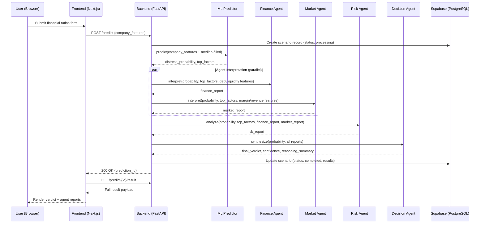
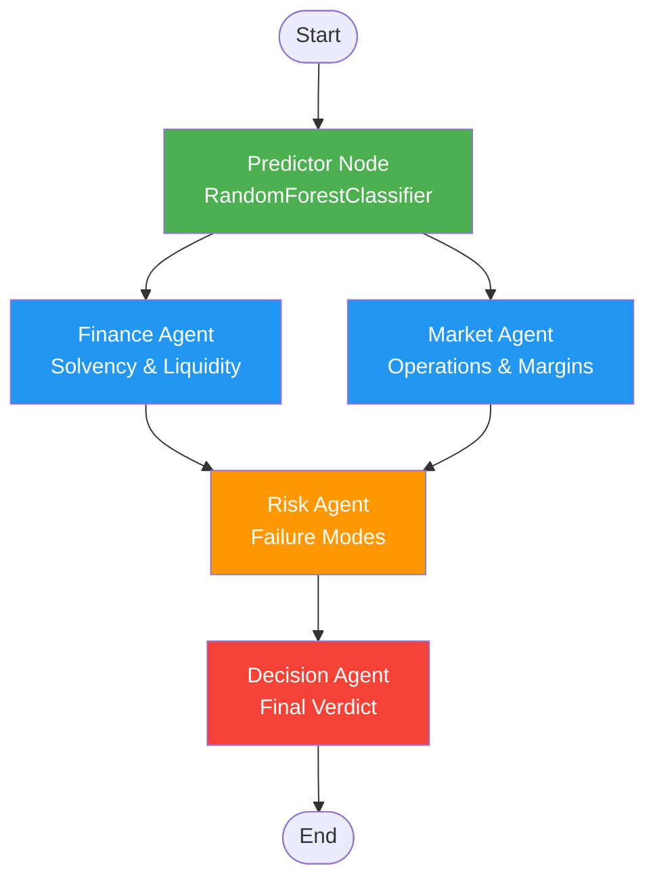

# Verdyx — Architecture Document

> **Version:** 1.0  
> **Last Updated:** 2026-08-20  
> **Status:** Approved for MVP build

---

## 1. System Overview

Verdyx is an ML-powered multi-agent system for predictive enterprise decision intelligence. The core architectural invariant is:

> **Prediction is architecturally prior to interpretation.**  
> The ML model produces a distress probability *before* any LLM agent runs. Agents interpret — they never generate the predictio```
┌─────────────────────────────────────────────────────────────────────┐
│                        VERDYX SYSTEM                                │
│                                                                     │
│  ┌──────────┐    ┌──────────┐    ┌──────────────┐    ┌──────────┐  │
│  │ Frontend │───▶│ Backend  │───▶│  ML Predictor │───▶│  Agents  │  │
│  │ (Next.js)│◀───│ (FastAPI)│◀───│  (sklearn RF) │◀───│(LangGraph│  │
│  └────┬─────┘    └────┬─────┘    └──────────────┘    └──────────┘  │
│       │               │                                             │
│       ▼               ▼                                             │
│  ┌──────────┐   ┌──────────┐                                        │
│  │  Browser │   │In-Memory │                                        │
│  │ LocalStg │   │ DictStore│                                        │
│  └──────────┘   └──────────┘                                        │
│       ┆               ┆ (Optional Cloud Stretch Goal)               │
│       └···············┼·············································┘
│                       ▼
│               ┌──────────────┐
│               │  PostgreSQL  │ (Future SaaS Extension)
│               │  (Supabase)  │
│               └──────────────┘
└─────────────────────────────────────────────────────────────────────┘
```

---

## 2. Architecture Layers

### 2.1 Layer Diagram

```
┌─────────────────────────────────────────────────────┐
│                 PRESENTATION LAYER                   │
│  Next.js 14+ │ Tailwind CSS │ Lucide │ Recharts     │
│  Interactive 10-Ratio Form │ Risk Gauge │ Agent Deck │
│  Client-side LocalStorage Persistence               │
├─────────────────────────────────────────────────────┤
│                   API GATEWAY                        │
│  Next.js API Client (lib/api.ts) → FastAPI Backend   │
│  REST endpoints │ CORS │ Fallback Simulation Engine │
├─────────────────────────────────────────────────────┤
│                 APPLICATION LAYER                    │
│  FastAPI │ Pydantic models │ In-memory store         │
│  Routes: POST /predict │ GET /predict/{id}          │
├─────────────────────────────────────────────────────┤
│                 PREDICTION LAYER                     │
│  RandomForestClassifier (scikit-learn)               │
│  predict_proba() │ feature_importances_ (MDI)        │
│  Loads predictor.pkl & medians via joblib/JSON       │
├─────────────────────────────────────────────────────┤
│              AGENT ORCHESTRATION LAYER               │
│  LangGraph StateGraph                                │
│  Nodes: Predictor → Finance ─┐                      │
│                     Market  ─┼─→ Risk → Decision     │
│                              │                       │
├─────────────────────────────────────────────────────┤
│                  DATA LAYER                          │
│  MVP: Browser LocalStorage + FastAPI In-Memory Store │
│  Production Stretch: Supabase (PostgreSQL + Auth)    │
└─────────────────────────────────────────────────────┘
```

### 2.2 Layer Responsibilities

| Layer | Responsibility | Technology |
|---|---|---|
| Presentation | User input form, results display, risk gauge, agent reports | Next.js, Tailwind, Recharts, Lucide |
| API Gateway | Route frontend requests to backend, handle CORS & offline fallback | Fetch API, `lib/api.ts` |
| Application | Request validation, orchestration dispatch, response formatting | FastAPI, Pydantic |
| Prediction | ML inference — distress probability + feature importances | scikit-learn RandomForestClassifier |
| Agent Orchestration | Multi-agent interpretation pipeline | LangGraph, Groq / Gemini / OpenAI |
| Data (MVP) | Instant scenario history without cloud dependencies | Browser `localStorage` + FastAPI in-memory store |
| Data (SaaS Extension) | Multi-tenant auth, cloud scenario sync | Supabase (PostgreSQL + Auth) |           │
├─────────────────────────────────────────────────────┤
│              AGENT ORCHESTRATION LAYER               │
│  LangGraph StateGraph                                │
│  Nodes: Predictor → Finance ─┐                      │
│                     Market  ─┼─→ Risk → Decision     │
│                              │                       │
├─────────────────────────────────────────────────────┤
│                  DATA LAYER                          │
│  PostgreSQL (Supabase) │ Supabase Auth               │
│  Tables: users │ scenarios │ predictions             │
└─────────────────────────────────────────────────────┘
```

### 2.2 Layer Responsibilities

| Layer | Responsibility | Technology |
|---|---|---|
| Presentation | User input form, results display, auth UI | Next.js, Tailwind, shadcn/ui, Recharts |
| API Gateway | Route frontend requests to backend, handle CORS | Next.js API routes / direct fetch |
| Application | Request validation, orchestration dispatch, response formatting | FastAPI, Pydantic |
| Prediction | ML inference — distress probability + feature importances | scikit-learn RandomForestClassifier |
| Agent Orchestration | Multi-agent interpretation pipeline | LangGraph, Gemini/OpenAI |
| Data | User auth, scenario persistence, prediction history | Supabase (PostgreSQL + Auth) |

---

## 3. Data Flow — End-to-End Pipeline

### 3.1 Request Flow (Happy Path)



### 3.2 Data Transformation Pipeline

```
User Input (8-10 fields)
    │
    ▼
Feature Vector Construction
    │  Merge user input with dataset medians
    │  Result: 95-dimension feature vector
    │
    ▼
ML Prediction (NO LLM involved)
    │  RandomForestClassifier.predict_proba()
    │  Output: float (0.0–1.0)
    │  + sorted feature_importances_ top 5
    │
    ▼
Agent Context Assembly
    │  Package: probability + top_factors + raw features
    │  Split features by domain:
    │    - Debt/liquidity → Finance Agent
    │    - Margin/revenue → Market Agent
    │    - Full set → Risk Agent
    │
    ▼
LLM Interpretation (3 agents, parallel where possible)
    │  Each agent receives ML output as FACT, not suggestion
    │  Agents explain, they do NOT re-estimate
    │
    ▼
Decision Synthesis
    │  Decision Agent reads all 3 reports + probability
    │  Outputs: risk_tier, confidence, reasoning_summary
    │
    ▼
Structured Response → Frontend
```

---

## 4. Component Architecture

### 4.1 Frontend Components

```
frontend/
├── app/
│   ├── layout.tsx                  # Root layout with providers
│   ├── page.tsx                    # Landing / marketing page
│   ├── (auth)/
│   │   ├── login/page.tsx          # Supabase login
│   │   ├── signup/page.tsx         # Supabase signup
│   │   └── callback/route.ts      # OAuth callback handler
│   ├── dashboard/
│   │   ├── layout.tsx              # Dashboard shell (sidebar + nav)
│   │   ├── page.tsx                # Dashboard overview / history list
│   │   ├── new-scenario/
│   │   │   └── page.tsx            # Input form (8-10 numeric fields)
│   │   └── [scenarioId]/
│   │       └── page.tsx            # Full results view
│   └── api/                        # Next.js API routes (proxy if needed)
├── components/
│   ├── ui/                         # shadcn/ui components
│   ├── scenario-form.tsx           # The main input form component
│   ├── prediction-result.tsx       # ML prediction display
│   ├── agent-report-card.tsx       # Individual agent report card
│   ├── verdict-display.tsx         # Final Decision Agent verdict
│   ├── risk-gauge.tsx              # Visual risk meter (Recharts)
│   ├── feature-importance-chart.tsx # Bar chart of top features
│   └── history-table.tsx           # Past predictions table
├── lib/
│   ├── supabase/
│   │   ├── client.ts               # Browser Supabase client
│   │   └── server.ts               # Server Supabase client
│   ├── api.ts                      # Backend API client functions
│   └── types.ts                    # Shared TypeScript types
├── tailwind.config.ts
├── next.config.js
└── package.json
```

### 4.2 Backend Components

```
backend/
├── main.py                         # FastAPI app factory, CORS, lifespan
├── routers/
│   └── predict.py                  # /predict endpoints
├── orchestrator/
│   ├── graph.py                    # LangGraph StateGraph definition
│   ├── state.py                    # ScenarioState TypedDict
│   └── config.py                   # LLM provider selection + config
├── agents/
│   ├── base_agent.py               # Shared agent utilities
│   ├── finance_agent.py            # Solvency/liquidity interpreter
│   ├── market_agent.py             # Operating/competitive position interpreter
│   ├── risk_agent.py               # Failure mode identifier
│   └── decision_agent.py           # Final verdict synthesizer
├── prediction/
│   ├── predictor.py                # Loads .pkl, runs inference
│   └── feature_config.py           # Feature names, medians, form field mapping
├── models/
│   └── schemas.py                  # Pydantic request/response models
├── db/
│   └── supabase_client.py          # Supabase Python client
├── requirements.txt
└── .env.example
```

### 4.3 ML Components

```
ml/
├── train_model.ipynb               # End-to-end training notebook
├── train_model.py                  # Script version for reproducibility
├── data/
│   └── taiwanese_bankruptcy.csv    # UCI dataset (6,819 × 96)
├── models/
│   ├── predictor.pkl               # Trained RandomForestClassifier
│   └── feature_medians.json        # Median values for all 95 features
├── evaluation/
│   └── metrics.json                # Precision, recall, F1, AUC scores
└── DATA_SOURCES.md                 # Citation + license
```

---

## 5. State Management

### 5.1 ScenarioState (LangGraph Shared State)

This is the single state object that flows through the entire agent pipeline:

```python
from typing import TypedDict

class ScenarioState(TypedDict):
    # --- Input (populated from form submission) ---
    scenario_id: str                    # UUID, assigned at creation
    user_id: str                        # From Supabase auth
    company_features: dict[str, float]  # 8-10 user fields + median-filled remainder
    
    # --- ML Prediction (populated by predictor node — FIRST) ---
    distress_probability: float         # 0.0 to 1.0, from predict_proba
    top_factors: list[tuple[str, float]] # (feature_name, importance_score), top 5
    
    # --- Agent Reports (populated sequentially) ---
    finance_report: str                 # From Finance Agent
    market_report: str                  # From Market Agent
    risk_report: str                    # From Risk Agent
    
    # --- Final Verdict (populated by Decision Agent — LAST) ---
    final_verdict: str                  # "Low Risk" | "Medium Risk" | "High Risk"
    confidence: float                   # 0.0 to 1.0
    reasoning_summary: str              # Plain-English explanation
```

### 5.2 LangGraph Execution Graph



**Execution order constraints:**
1. **Predictor** always runs first (no LLM calls, pure ML)
2. **Finance Agent** and **Market Agent** can run in parallel (no dependency on each other)
3. **Risk Agent** runs after both Finance and Market (reads their reports)
4. **Decision Agent** runs last (reads everything)

---

## 6. API Contract

### 6.1 Endpoints

#### `POST /predict` — Submit a new prediction

**Request:**
```json
{
  "company_features": {
    "debt_ratio": 0.62,
    "current_ratio": 1.1,
    "net_income_to_total_assets": 0.02,
    "operating_margin": 0.04,
    "retained_earnings_to_total_assets": 0.05,
    "revenue_per_share": 0.15,
    "total_asset_turnover": 0.8,
    "working_capital_to_total_assets": 0.12
  }
}
```

**Response (202 Accepted):**
```json
{
  "prediction_id": "uuid-here",
  "status": "processing",
  "message": "Prediction pipeline initiated"
}
```

#### `GET /predict/{id}` — Check prediction status

**Response:**
```json
{
  "prediction_id": "uuid-here",
  "status": "processing" | "completed" | "failed",
  "created_at": "2026-08-20T10:30:00Z"
}
```

#### `GET /predict/{id}/result` — Get full prediction result

**Response (200 OK):**
```json
{
  "prediction_id": "uuid-here",
  "status": "completed",
  "distress_probability": 0.71,
  "risk_tier": "High Risk",
  "top_factors": [
    {"feature": "Debt ratio", "importance": 0.18},
    {"feature": "Operating Profit Rate", "importance": 0.12},
    {"feature": "Retained Earnings to Total Assets", "importance": 0.09}
  ],
  "agent_reports": {
    "finance": "Solvency is fragile — debt ratio well above...",
    "market": "Thin operating margin suggests weak pricing...",
    "risk": "Combination of high leverage + thin margin is..."
  },
  "final_verdict": {
    "tier": "High Risk",
    "confidence": 0.85,
    "reasoning": "Primary drivers: leverage and margin, not liquidity in isolation..."
  },
  "created_at": "2026-08-20T10:30:00Z"
}
```

#### `GET /predict` — List prediction history (per user)

**Response:**
```json
{
  "predictions": [
    {
      "prediction_id": "uuid-1",
      "risk_tier": "High Risk",
      "distress_probability": 0.71,
      "created_at": "2026-08-20T10:30:00Z"
    },
    {
      "prediction_id": "uuid-2",
      "risk_tier": "Low Risk",
      "distress_probability": 0.12,
      "created_at": "2026-08-19T14:00:00Z"
    }
  ]
}
```

### 6.2 Error Responses

```json
{
  "detail": "Error message",
  "error_code": "PREDICTION_FAILED" | "AGENT_ERROR" | "VALIDATION_ERROR",
  "status_code": 400 | 500
}
```

---

## 7. Database Schema

### 7.1 Supabase Tables

```sql
-- Users table (managed by Supabase Auth, extended with profile)
CREATE TABLE profiles (
    id UUID REFERENCES auth.users(id) PRIMARY KEY,
    email TEXT NOT NULL,
    full_name TEXT,
    created_at TIMESTAMPTZ DEFAULT NOW()
);

-- Scenarios / Predictions
CREATE TABLE predictions (
    id UUID PRIMARY KEY DEFAULT gen_random_uuid(),
    user_id UUID REFERENCES profiles(id) NOT NULL,
    status TEXT NOT NULL DEFAULT 'processing'
        CHECK (status IN ('processing', 'completed', 'failed')),
    
    -- Input
    company_features JSONB NOT NULL,
    
    -- ML Output
    distress_probability FLOAT,
    top_factors JSONB,  -- [{feature, importance}, ...]
    
    -- Agent Reports
    finance_report TEXT,
    market_report TEXT,
    risk_report TEXT,
    
    -- Final Verdict
    final_verdict TEXT,
    confidence FLOAT,
    reasoning_summary TEXT,
    risk_tier TEXT CHECK (risk_tier IN ('Low Risk', 'Medium Risk', 'High Risk')),
    
    -- Metadata
    created_at TIMESTAMPTZ DEFAULT NOW(),
    completed_at TIMESTAMPTZ,
    error_message TEXT
);

-- Row Level Security
ALTER TABLE predictions ENABLE ROW LEVEL SECURITY;

CREATE POLICY "Users can view own predictions"
    ON predictions FOR SELECT
    USING (auth.uid() = user_id);

CREATE POLICY "Users can insert own predictions"
    ON predictions FOR INSERT
    WITH CHECK (auth.uid() = user_id);
```

---

## 8. Agent Prompt Architecture

Each agent receives a structured prompt with the ML prediction as **established fact**, not suggestion.

### 8.1 Prompt Template Pattern

```
You are the {AGENT_ROLE} in a financial distress analysis system.

IMPORTANT: The distress probability of {distress_probability}% has already been
computed by a trained RandomForestClassifier on verified financial data.
Your job is to INTERPRET and EXPLAIN this prediction — NOT to generate your own
probability estimate. The number is a fact; your job is to explain WHY it
makes sense given the financial data below.

## Prediction Context
- Distress Probability: {distress_probability}%
- Top Contributing Factors: {top_factors}

## Company Financial Data
{relevant_features}

## Your Task
{agent_specific_instructions}
```

### 8.2 Agent-Specific Instructions

| Agent | Focus Area | Input Features | Instruction |
|---|---|---|---|
| Finance Agent | Solvency & Liquidity | Debt ratio, current ratio, retained earnings/total assets, working capital/total assets | Explain the company's solvency position and liquidity cushion. Reference specific ratios and compare to healthy ranges observed in the training dataset. |
| Market Agent | Operations & Margins | Operating margin, revenue per share, total asset turnover, net income/total assets | Explain the company's operational efficiency and competitive position. Assess pricing power and cost control. |
| Risk Agent | Failure Modes | All features + finance_report + market_report | Identify specific, named failure modes. Don't just say "risky" — say what specific scenario would cause distress. |
| Decision Agent | Synthesis | All reports + probability | Produce a final verdict: risk tier (Low/Medium/High), confidence score, and a 2-3 sentence plain-English summary of primary drivers. |

---

## 9. Feature Engineering & Form Mapping

### 9.1 Form Fields → Model Input

The user fills in 8-10 key financial ratios. The remaining ~85 features are filled with their **dataset median values** so the model always receives a complete 95-dimension vector.

```python
# feature_config.py
FORM_FIELDS = {
    "debt_ratio": {
        "label": "Debt Ratio",
        "description": "Total Debt / Total Assets",
        "dataset_column": "Debt ratio %",
        "min": 0.0, "max": 1.0, "step": 0.01,
        "default_median": 0.43  # from dataset
    },
    # ... 7-9 more fields, determined after training
}

# At inference time:
full_vector = DATASET_MEDIANS.copy()       # 95 features, all at median
full_vector.update(user_input)              # overwrite the 8-10 user-provided
model.predict_proba([list(full_vector.values())])
```

### 9.2 Feature Domain Mapping (for agent routing)

```python
FINANCE_FEATURES = [
    "Debt ratio %", "Current Ratio", "Quick Ratio",
    "Retained Earnings to Total Assets",
    "Working Capital to Total Assets",
    "Borrowing dependency"
]

MARKET_FEATURES = [
    "Operating Profit Rate", "Net Income to Total Assets",
    "Revenue Per Share (Yen)", "Total Asset Turnover",
    "Operating Profit Per Share (Yen)"
]
```

---

## 10. Deployment Architecture

```
┌────────────────────────────┐     ┌────────────────────────────┐
│        VERCEL               │     │     RAILWAY / RENDER       │
│                             │     │                            │
│  ┌──────────────────────┐  │     │  ┌──────────────────────┐  │
│  │    Next.js App        │  │────▶│  │    FastAPI Server     │  │
│  │    (SSR + Static)     │  │     │  │    (uvicorn)          │  │
│  └──────────────────────┘  │     │  └──────────┬───────────┘  │
│                             │     │             │              │
│  Environment:               │     │  ┌──────────▼───────────┐  │
│  NEXT_PUBLIC_SUPABASE_URL  │     │  │  predictor.pkl        │  │
│  NEXT_PUBLIC_SUPABASE_ANON │     │  │  (loaded at startup)  │  │
│  NEXT_PUBLIC_API_URL       │     │  └────────────────────────┘  │
└────────────────────────────┘     │                            │
                                    │  Environment:              │
          ┌─────────────────┐      │  OPENAI_API_KEY /          │
          │    SUPABASE      │◀────│  GEMINI_API_KEY            │
          │                  │      │  DATABASE_URL              │
          │  PostgreSQL DB   │      │  SUPABASE_SERVICE_ROLE_KEY │
          │  Auth Service    │      └────────────────────────────┘
          │  Row Level Sec.  │
          └─────────────────┘
```

### 10.1 Startup Sequence (Backend)

1. Load `predictor.pkl` into memory via `joblib.load()` (one-time, at process start)
2. Load `feature_medians.json` into memory
3. Initialize Supabase client
4. Initialize LangGraph with agent nodes
5. Start uvicorn server

### 10.2 Performance Considerations

| Component | Expected Latency | Notes |
|---|---|---|
| ML Prediction | <100ms | In-memory model, no I/O |
| Finance Agent | 2-5s | Single LLM call |
| Market Agent | 2-5s | Single LLM call (parallel with Finance) |
| Risk Agent | 2-5s | Single LLM call (after Finance + Market) |
| Decision Agent | 2-5s | Single LLM call |
| **Total Pipeline** | **8-15s** | With parallel Finance/Market |
| DB Write | <50ms | Supabase managed |

---

## 11. Security Considerations

1. **Authentication:** Supabase Auth handles user management. JWT tokens passed to backend.
2. **Row Level Security:** PostgreSQL RLS ensures users can only see their own predictions.
3. **API Keys:** All LLM API keys stored server-side only (never exposed to frontend).
4. **Input Validation:** Pydantic models enforce numeric ranges on all form fields.
5. **CORS:** Restricted to frontend domain in production.
6. **Rate Limiting:** Consider adding per-user rate limiting on `/predict` endpoint.

---

## 12. Architectural Decision Records (ADRs)

### ADR-001: Prediction before interpretation
**Decision:** ML model runs before any LLM agent, with no exceptions.  
**Rationale:** This is the core novelty claim. If agents could estimate the probability themselves, the ML model becomes redundant and the architecture loses its defensibility.

### ADR-002: RandomForest over XGBoost
**Decision:** Use `RandomForestClassifier` instead of `XGBoostClassifier`.  
**Rationale:** Same model family (tree ensemble), but RF has fewer hyperparameters, more forgiving defaults, and better beginner documentation. The architecture doesn't depend on which tree ensemble is used.

### ADR-003: Median-fill for unexposed features
**Decision:** Features not on the input form are filled with their dataset median.  
**Rationale:** The model requires all 95 features. Dataset median is a neutral default that doesn't bias the prediction toward distress or health. More sophisticated imputation is a stretch goal.

### ADR-004: Parallel Finance + Market, sequential Risk → Decision
**Decision:** Finance and Market agents run in parallel; Risk depends on both; Decision depends on Risk.  
**Rationale:** Risk Agent needs Finance and Market reports to identify compound failure modes. Decision Agent needs all context for final synthesis. Parallelizing Finance + Market saves 2-5s.

### ADR-005: class_weight='balanced' over SMOTE
**Decision:** Use `class_weight='balanced'` for handling class imbalance.  
**Rationale:** Single parameter, no additional pipeline complexity. SMOTE is a valid stretch goal but `class_weight='balanced'` is sufficient for the MVP and well-documented for this dataset.

### ADR-006: LocalStorage + In-Memory Store for MVP (Decoupled from Supabase)
**Decision:** Use browser `localStorage` on the frontend and an in-memory dictionary on the FastAPI backend for scenario history persistence during the MVP/demo phase. Supabase (PostgreSQL + Auth) is retained as an optional future SaaS extension.  
**Rationale:** The core novelty of Verdyx is the ML-Prior multi-agent decision intelligence architecture. Requiring cloud database credentials, row-level security setups, and user authentication adds external failure points without contributing to the machine learning or agentic reasoning thesis. LocalStorage + in-memory store provides instant, reliable, zero-latency persistence suitable for viva demonstrations and offline presentations.

---

*This document should be updated as architectural decisions evolve during development.*
